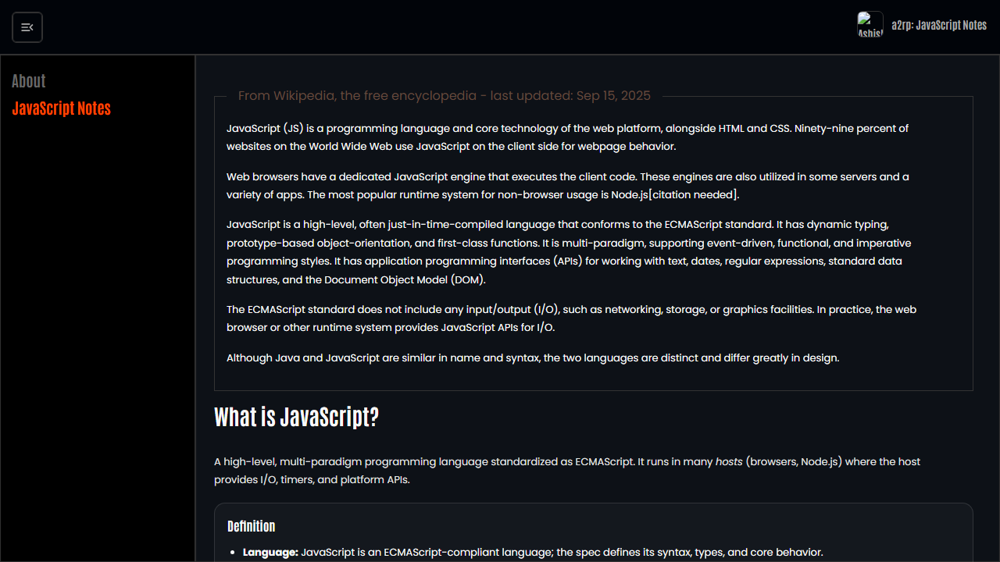

# JavaScript Notes

JavaScript Notes is a searchable, single-page reference for JavaScript fundamentals, language internals, browser APIs, asynchronous code, and practical engineering patterns.

## Features

- Micro-topic navigation with focused explanations
- Expandable Q&A notes and practical examples
- Lazy-loaded pages with route-aware scrolling
- Responsive fixed header, collapsible navigation, icon-only footer links, and go-to-top control
- Local logo, favicon, and social preview assets

## Tech stack

React, Vite, React Router, Material UI, styled-components, React Icons, QRCode, and jsQR.

## Run locally

```bash
npm install
npm run dev
```

Build and deploy with `npm run build` and `npm run deploy`.

## Screenshot



## Links

- Live: [https://a2rp.github.io/javascript-notes/](https://a2rp.github.io/javascript-notes/)
- Repository: [https://github.com/a2rp/javascript-notes](https://github.com/a2rp/javascript-notes)
- Portfolio: [https://www.ashishranjan.net/](https://www.ashishranjan.net/)
- GitHub: [https://github.com/a2rp](https://github.com/a2rp)
- CodePen: [https://codepen.io/ash1198](https://codepen.io/ash1198)
- LinkedIn: [https://www.linkedin.com/in/aashishranjan](https://www.linkedin.com/in/aashishranjan)
- Facebook: [https://www.facebook.com/theash.ashish/](https://www.facebook.com/theash.ashish/)
- YouTube: [https://www.youtube.com/@ashishranjan-ashz?sub_confirmation=1](https://www.youtube.com/@ashishranjan-ashz?sub_confirmation=1)
- Email: [ash.ranjan09@gmail.com](mailto:ash.ranjan09@gmail.com)

## Support

- Support: [https://a2rp-donation-page.netlify.app/](https://a2rp-donation-page.netlify.app/)
- Buy Me a Coffee: [https://buymeacoffee.com/a2rp](https://buymeacoffee.com/a2rp)
- Patreon: [https://www.patreon.com/a2rp](https://www.patreon.com/a2rp)
